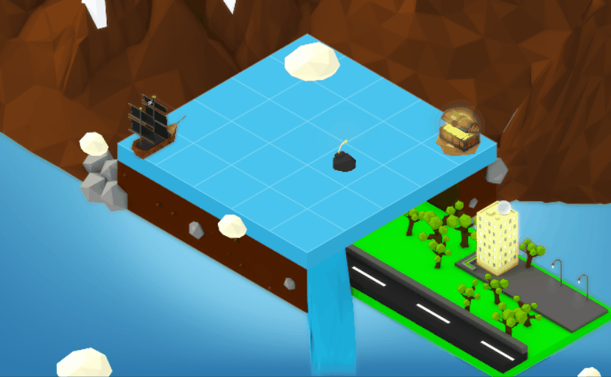
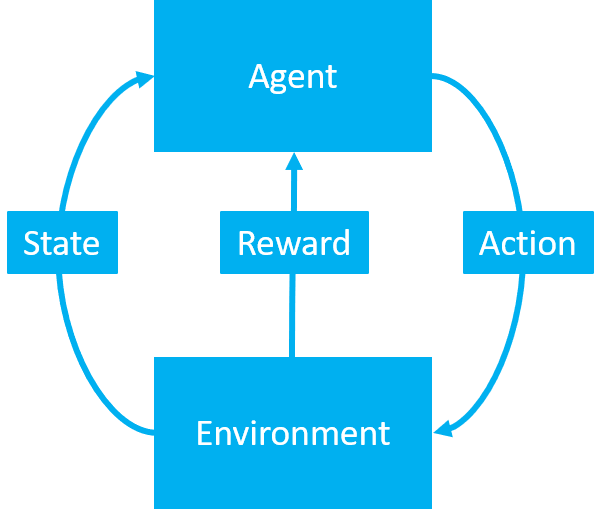
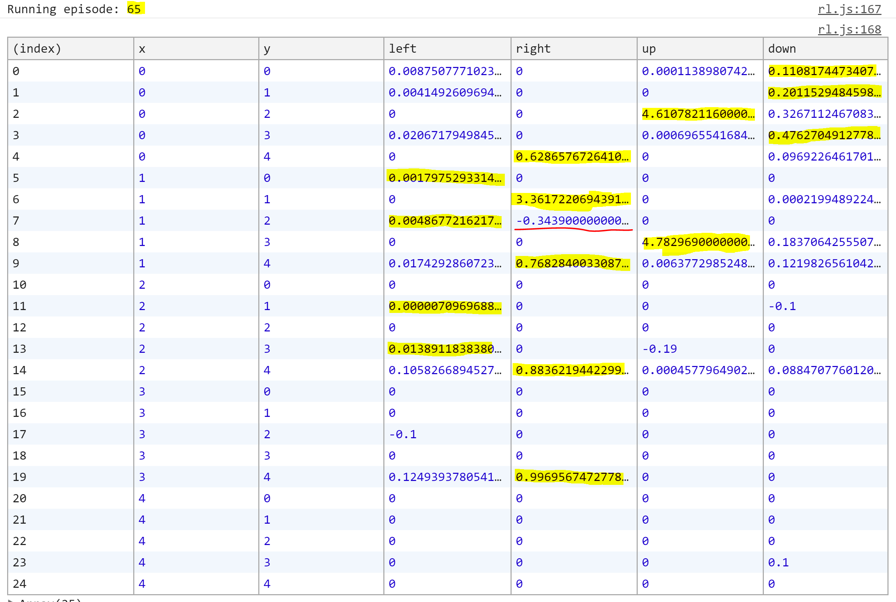
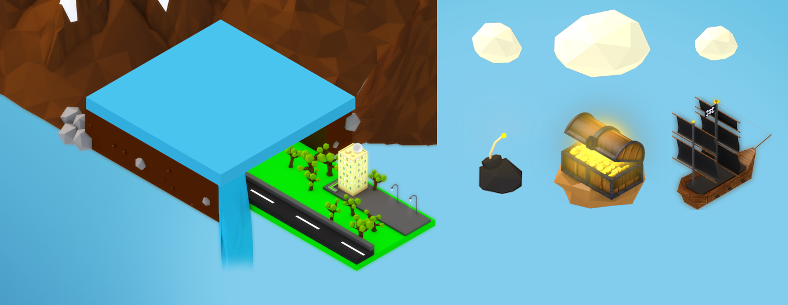
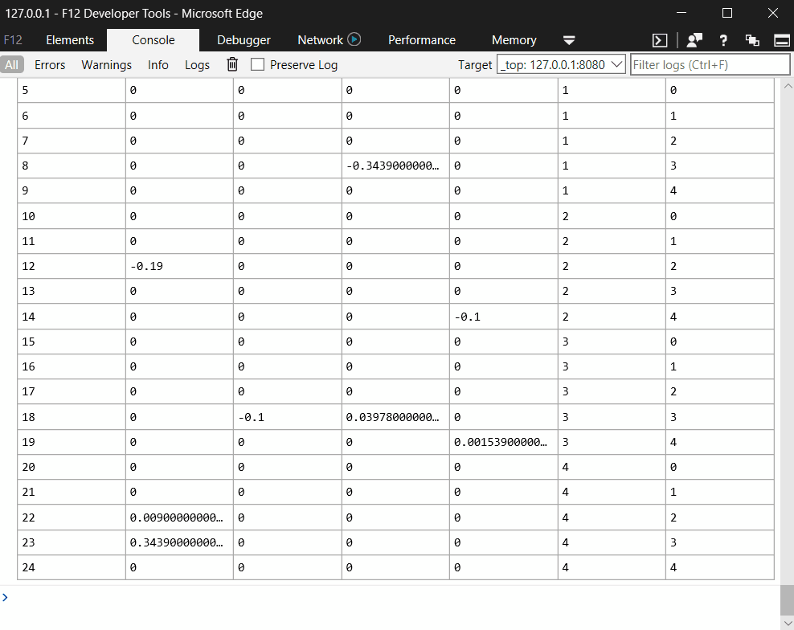

# How the pirate ship learned to find the treasure - a reinforcement learning story

Reinforcement learning is a fun topic, especially when you set out to create something that is visually appealing while maintaining the logical part of things. We set out to use Q-learning, where we represent scored actions (in states) for an agent that tries a to get a reward. In our case, this means a pirate ship trying to get to the treasure! 

We begin by mapping actions for every state (location) in what a table (Q-table). This is essentially being the "answer" to the optimal path (set of actions) towards the reward. 

The tricky part here is that not all the actions give a positive reward. We placed a bomb in the environment to indicate for the agent that this is a dangerous path to follow. To learn this, it must explore. An interesting note here is that you can easily see that the ship is taking a lot of seemingly random actions while exploring the environment. After a while, the ship gets smarter and makes more sensible decisions - which originates from the Q-table behind the scenes.

We chose to build a visual environment, although everything could be done without such. The reason has been to illustrate how reinforcement learning and Q-learning works in an appealing manner. We used HTML/CSS/JavaScript to build out this sample.



### Prerequisites ###
- Node.js and NPM: <https://nodejs.org/en/>

### Version history ###
Version  | Date | Author(s) | Comments
---------| ---- | --------- | --------
1.0  | 1/5/2018 | [Anders Gill](https://twitter.com/TheRealShadyman), [Simon Jäger](https://twitter.com/simonjaegr)  | Initial release

### Disclaimer ###
**THIS CODE IS PROVIDED *AS IS* WITHOUT WARRANTY OF ANY KIND, EITHER EXPRESS OR IMPLIED, INCLUDING ANY IMPLIED WARRANTIES OF FITNESS FOR A PARTICULAR PURPOSE, MERCHANTABILITY, OR NON-INFRINGEMENT.**

----------

# Background #

## Definitions ##

**Agent** 

The player or object in the environment making the actions that changes the state of the agent. 

**Environment**

The playground which the agent takes the actions and gains the reward from.

**Reward**

To measure success or failure (by an action or exploration because of an action), the reward is a measure that is given to the agent by the environment. This way we know what the feedback is based on certain actions, and we can learn from that. 

Like a trained dog, when you say "paw" and it gives you the paw - you reward it with a treat. In our case, the dog is the agent, and the giving of the paw is the action. This is rewarded through the treat.

**Policy (π)**

The strategy which the agent follows when choosing what action to take next. The agent is always in a state, so based on the action that results in another state, the agent decided to follow some sort of "carrot" to make the action it did. 

**Learning rate (α)**

The learning rate (value between 0 and 1) defines how fast new information will override old information. In other words, how fast will the agent learn new things?

**Discount factor (γ)**

The discount factor defines how long in the future the agent looks for rewards. If the discount factor value is closer to zero, the agent doesn't consider rewards in the distant future (shallow look-ahead). If the discount factor is closer to one, the agent is considering rewards in the future as well and not just the immediate future. It's also possible to apply a dynamic discount factor.

**Q-learning flow**

The agent observes the environment, takes an action to interact with the environment, and receives a reward.



In this sample, we store estimated values of actions (Q-value) in the mentioned Q-table (see down below). 

The first two columns (except the index column) represent the states by the position on the board (X and Y coordinates). The additional columns are the Q-values of the action taken in that state. The Q-value is estimating the reward from that action and the future actions - for the agent (pirate ship). This Q-table is constructed as the agent explores the environment.

For the agent to not only follow the highest value in the Q-table, we introduced some randomness denoted as epsilon. The epsilon is a value that defines the probability for taking a random action, this allows us to introduce "exploration" in the agent. 

If a random action is not taken, the agent will choose the highest value from the action in the Q-table (acting greedy). 

This whole process is an example of what a policy can look like. The Q-table below has run for 65 episodes. The reason why not all the cells have a Q-value (some are zero) is because the agent hasn't explored all of the possible observable states yet. Pay attention to the negative values, where the environment has punished the agent (the bomb).



## Policies ##

The policy is the strategy of picking the action to take in a state. It defines the behavior of the agent, and there are many ways in which the agents can act.

There are also many other policies than mentioned here, some interesting ones revolving around probabilities that you may want to read more about (Boltzmann, Bayesian, etc.).

**Greedy policy**

All reinforcement learning algorithms seek to maximize reward. What the greedy policy does is that it chooses to always pick the action (no matter state) that gives the highest reward at that point in time. Without considering the long-term benefit.

**ϵ-Greedy policy**

For the ϵ-greedy policy, the agent selects the action that most of the time is the optimal action. But to explore more options and potentially find something that is better (a higher reward), introduces the epsilon factor (randomness). 

This is a great technique which is widely used in reinforcement learning. It is also worth mentioning that after a while, it is possible to slowly decrease the epsilon so that the exploration becomes less frequent and the model converges to an optimal policy.

**Random policy**

Instead of being greedy in terms of what action to take depending on the reward, the random policy simply instructs the agent to randomly pick an action at any given state.

# Implementation #

## Running the sample ##

The sample is using the [http-server](https://www.npmjs.com/package/http-server) library to serve the files. It is also using the [CreateJS](https://createjs.com/) library to render graphics using HTML5.

1. Clone this repository (git clone https://github.com/xxx/xxx.git).
2. Navigate into the source folder.
3. Open the command line.
4. Install the NPM packages by running the following command.
```
npm install
```
5. Start the sample by running the following command.
```
npm start
```
6. Launch your browser and go to the URL mentioned in the above command.


## Files ##

Notable files in the project are noted down below. Many of the files are revolving around rendering, which may not be that interesting. Please refer to the *rl.js* file for the reinforcement learning logic.

File(s)  | Comments
----- | ----
src/assets/*.png        | Assets to render.
src/block.js            | Render logic for the block (platform).
src/bomb.js             | Render logic for the block.
src/chest.js            | Render logic for the chest.
src/cloud.js            | Render logic for the cloud.
src/index.html          | HTML layout for render.
src/main.css            | Styles for HTML layout.
src/main.js             | Main logic which ties everything together.
src/rl.js               | Reinforcement logic.
src/ship.js             | Render logic for the ship.

## Artefacts ###

We created the following artefacts to be rendered in the sample. 



The logic for loading and rendering these artefacts are contained in individual files. For example, see the *initialize* function in *cloud.js*:

```js
var initialize = function (stage) {
        // Create assets and objects.
        this.bitmap = new createjs.Bitmap('assets/cloud' + index + '.png');

        if (DEBUG) {
            this.circle = new createjs.Shape();
            this.circle.graphics.beginFill("Blue").drawCircle(0, 0, 10);
        }

        stage.addChild(this.bitmap);

        if (DEBUG) {
            stage.addChild(this.circle);
        }
    }.bind(that);
```

These are then orchestrated in the *main.js* file.


## Configuration and logging ##

**Logging**

A few different things can be noted as for running the sample. You should launch the developer tools in your browser to find interesting outputs.

In the console, you will find the Q-table being updated with new values as the agent makes its exploration.



**Exploration speed**

You can adjust the speed in which the exploration happens by setting the *WAIT* constant in the *rl.js* file.

```js
var WAIT = 100;
```

This constant is merely a visual effect, setting a delay between actions that the agent will take.

**Tiles**

You can increase the number of tiles the playground is divided into by setting the *TILES* constant in the *main.js* file.

```js
var TILES = 5;
```

More tiles mean a larger environment and more time will be needed by the agent to explore it.

You can also alter the appearance of the tile layout by setting the *DEBUG* and *GRID* flags in the *main.js* file.

```js
var DEBUG = false;
var GRID = true;
```

**Positions**

In addition to changing the number of tiles, you can also set the starting positions of a few objects. This is done by altering the *POSITIONS* object in the *main.js* file.

```js
// Positions for the movable objects. Coordinates 
// should be within the range of tiles.
var POSITIONS = {
    ship: {
        x: 0,
        y: 4
    },
    chest: {
        x: TILES - 1,
        y: TILES - 1
    },
    bomb: {
        x: 2,
        y: 3
    }
};
```

You can set the starting position of the ship, chest and bomb.

## Reinforcement learning ##

Regard the *rl.js* file, section by section. We have implemented this file with the set of functionalities needed, see down below.

1. Create the Q-table.
1. Get the state by the X and Y coordinates.
1. Get the action with the highest Q-value of a state. Need to return both the indexer of the action and the value for scoring.
1. Choose an action with the ϵ-Greedy policy.
1. Perform the action and return the reward from the environment. 
1. Run the consecutive episodes, calculate Q-values and steps and finally update the UI.

The algorithm which we are implementing for calculating the Q-value is the following:


You can read more in-depth about this algorithm here: [https://en.wikipedia.org/wiki/Q-learning#Algorithm](https://en.wikipedia.org/wiki/Q-learning#Algorithm)

**Create the Q-table**

We need a data structure to store and retrieve the Q-values from. It needs to contain an indexer for every state, and placeholder for the Q-value of every possible action.

As you may figure, if the environment is complex - this solution will not be viable. At this point you need to apply a different strategy using predictions instead. But in our case, the in-memory store will work. 

```js
// Build Q-table function.
function buildQTable() {
    var result = [];
    for (var x = 0; x < TILES; x++) {
        for (var y = 0; y < TILES; y++) {
            var state = { x, y };

            // For every action, add a property with the 
            // action name and set the value to zero.
            for (var j = 0; j < ACTIONS.length; j++) {
                state[ACTIONS[j]] = 0;
            }
            result.push(state);
        }
    }
    return result;
}
```

**Get the state by the X and Y coordinates.**

As mentioned, we will use the X and Y coordinates to retrieve the state and all its Q-values for every action.

```js
// Get state function.
function getState(x, y, qTable) {
    for (var i = 0; i < qTable.length; i++) {
        if (qTable[i].x == x && qTable[i].y == y) {
            return qTable[i];
        }
    }
}
```

**Get the action with the highest Q-value of a state**

For a given state, we need the ability to retrieve the index of the action with the highest Q-value. This is used to communicate to the environment which action the agent should take.

We also need to get the value of the action with the highest Q-value (in a state), as we use in when calculating the new Q-value for another state. The reason is that we consider the "future rewards" of actions (discounted) so that the agent can find rewards through a path.

```js
// Get max action from state.
function _getMaxAction(state) {
    // Assume the first action is max.
    var name = ACTIONS[0];
    var value = state[ACTIONS[0]]

    for (var i = 1; i < ACTIONS.length; i++) {
        // Check if any of the actions is "higher" than the
        // current action.
        if (state[ACTIONS[i]] > value) {
            name = ACTIONS[i];
            value = state[ACTIONS[i]];
        }
    }

    return [name, value];
}

// Get max action from state.
function getMaxAction(state) {
    // Get only the name (index).
    return _getMaxAction(state)[0];
}

// Get max action from state.
function getMaxActionValue(state) {
    // Get only the value.
    return _getMaxAction(state)[1];
}
```

**Choose an action with the ϵ-Greedy policy**

For us to apply our policy and take an action (be it either the best or a random one), we created the following methods.

We default to always picking a random action if the state does not contain any former Q-values (unexplored territory). If not, we will use the probability defined by the epsilon. 

```js
// Check all zero function.
function allZero(state) {
    for (var i = 0; i < ACTIONS.length; i++) {
        if (state[ACTIONS[i]] != 0) {
            return false;
        }
    }
    return true;
}

// Choose action function.
function chooseAction(state, qTable) {
    if (Math.random() > EPSILON || allZero(state)) {
        // Pick random action.
        return ACTIONS[Math.floor(Math.random() * ACTIONS.length)];
    }
    return getMaxAction(state);
}
```

**Perform the action and return the reward from the environment.**

Once we have figured out our next action, we perform it and return the reward. The reward is signified by either -1, 0 or 1. 

A negative reward will indicate that we did something we should refrain from doing - such as hitting the bomb. A positive action indicates that we found the reward, the treasure. 

No reward tells us that we ought to keep exploring.

We also restrict the action so that it doesn't do anything the environment doesn't support. In this case, walking off the edge.

Finally, we indicate if the episode has completed early, by either hitting the bomb or finding the treasure.

```js
// Get environment feedback.
function getEnvFeedback(state, action, qTable) {
    var nextX = state.x;
    var nextY = state.y;
    var reward = 0;

    if (action == 'left') {
        if (state.x > 0) {
            nextX -= 1;
        }
    }
    else if (action == 'right') {
        if (state.x < TILES - 1) {
            nextX += 1;
        }
    }
    else if (action == 'up') {
        if (state.y > 0) {
            nextY -= 1;
        }
    }
    else if (action == 'down') {
        if (state.y < TILES - 1) {
            nextY += 1;
        }
    }

    // Check if the next x and next y is at the treasure.
    if (nextX == POSITIONS.chest.x && nextY == POSITIONS.chest.y) {
        reward = 1;
    }
    else if (nextX == POSITIONS.bomb.x && nextY == POSITIONS.bomb.y) {
        reward = -1;
    }

    // Get the next state.
    var nextState = 'terminal';
    if (reward == 0) {
        nextState = getState(nextX, nextY, qTable);
    }

    return {
        nextState: nextState,
        reward: reward
    };
}
```

**Run the consecutive episodes, calculate Q-values and steps and finally update the UI**

At this point, we can tie everything together. We will leverage one loop to run the episodes and another one to run the steps (actions which the agent takes).

```js
function startRl() {
    console.log('Creating table...');

    // Create table.
    var qTable = buildQTable();

    // Go through the episodes.
    var episode = 1;

    function run_episode() {
        console.log('Running episode: ' + episode);
        console.table(qTable);

        $('#episode').text('Episode: ' + episode);
        $('#step').text('Step: 0');

        var stepCount = 0;
        var state = getState(0, 0, qTable);
        var terminated = false;

        // Update environment.
        updateEnv(state);

        // Run the step.
        function run_step() {
            if (terminated) {
                $('#history').append('Episode ' + episode +
                    ', Steps: ' + stepCount + '<br/>');
                episode += 1;
                if (episode < MAX_EPISODES) {
                    run_episode();
                }
            }
            else {
                var action = chooseAction(state, qTable);
                var envFeedback = getEnvFeedback(state, action, qTable);

                var qPredict = state[action];
                var qTarget;
                if (envFeedback.nextState != 'terminal') {
                    // Get next state.
                    var nextState = envFeedback.nextState;

                    // Get max.
                    var max = getMaxActionValue(nextState);
                    qTarget = envFeedback.reward + GAMMA * max;
                }
                else {
                    qTarget = envFeedback.reward;
                    terminated = true;
                    POSITIONS.ship.x = 0;
                    POSITIONS.ship.y = 0;
                }

                state[action] += ALPHA * (qTarget - qPredict);
                state = envFeedback.nextState;

                updateEnv(state);
                stepCount += 1;

                $('#steps').text('Step: ' + stepCount);

                // Run step again.
                setTimeout(run_step, WAIT);
            }
        }

        // Start the first step.
        run_step();
    }

    // Run the next episode
    run_episode();
}
```

Let's break the important pieces down. In the *run_step* function, we perform the Q-value calculation. Where the *qPredict* variable is the current Q-value for the action in the state. 

```js
var qPredict = state[action];
```

The *qTarget* variable is the reward for the action in the state and estimated value (discounted by the gamma variable) of the next state.

```js
// Get next state.
var nextState = envFeedback.nextState;

// Get max.
var max = getMaxActionValue(nextState);
qTarget = envFeedback.reward + GAMMA * max;
```

Notice that this value is then added (and discounted by the learning rate, alpha variable).

```js
state[action] += ALPHA * (qTarget - qPredict);
```

##  Summary ##

Reinforcement learning with Q-learning may seem overwhelming, but once you get the intuition behind it - it's simple and elegant.

Q-learning can also be taken further and needs to. While our environment is simple, more complicated ones simply render too large Q-tables if you use the same method. In such scenarios, you ought to apply deep learning to train models to predict Q-values. 

Our intention was to take one of the simplest concepts of reinforcement learning and build out a visual illustration of how it works. 

We would also invite you to think about other ways of representing the state of the agent. Right now, we represent it solely by its position - but this is an area you can take wherever you want. What if the agent could also see its target (distance to reward)? 

There are many ways to view and design the problem, so be brave - and explore yarr way! Oh hoy!

